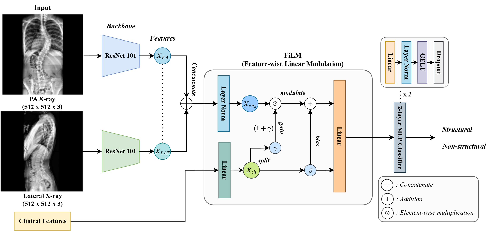
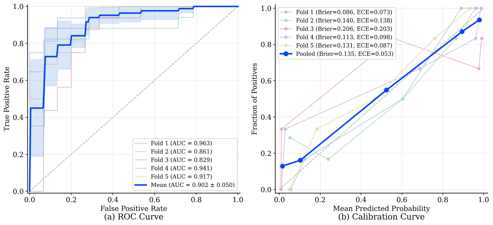
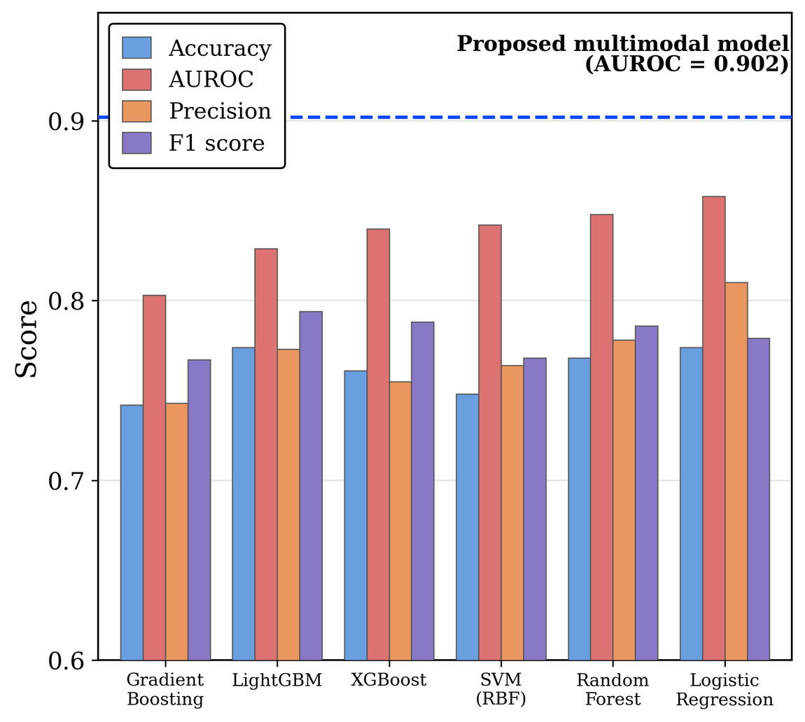
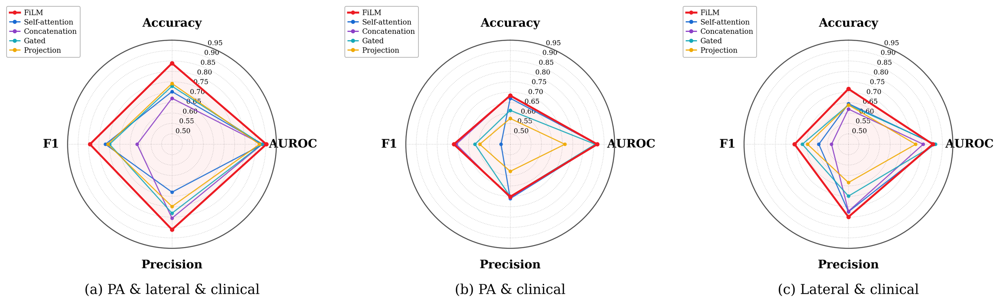
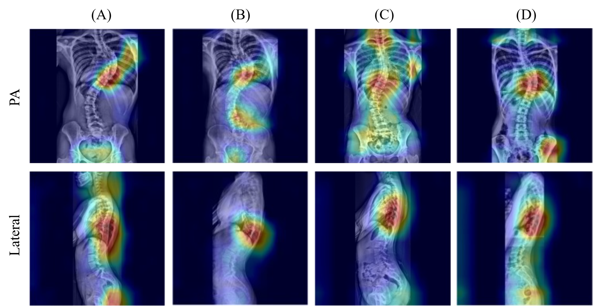

# SMC-scoliosis-structural

Dual-view multimodal deep learning that predicts whether the **lumbar curve is structural** in adolescent idiopathic scoliosis (AIS), from the standing radiographs already taken during routine preoperative evaluation — no side-bending film required.

This repository contains the research code for:

> **Dual-View Radiograph–Clinical Fusion for Structural Lumbar Curve Classification in Adolescent Idiopathic Scoliosis**
> *Manuscript under peer review.* Citation and DOI will be added on acceptance.

---

## Overview

In AIS surgery, whether the thoracolumbar/lumbar curve is *structural* drives how far down the fusion goes. The Lenke classification settles that question on a **side-bending radiograph** — an extra acquisition, an extra dose, and a measurement sensitive to how the patient was positioned and how hard they bent. Supine radiographs, recumbent CT and MRI have all been proposed as substitutes, but each is still one more scan.

The standing PA and lateral films are already on file for every surgical candidate. The question this work asks is whether they, plus a few clinical variables, already carry the answer.

They largely do. A dual-view model reaches **AUROC 0.902** with balanced sensitivity and specificity, and — as Grad-CAM shows — it does so by reading the **thoracolumbar transition zone**, not by re-measuring the lumbar Cobb angle it was handed as an input.

**Inputs** — standing PA radiograph, standing lateral radiograph, and four clinical variables (sex, age, standing lumbar Cobb angle, L1–S1 lordosis).
**Output** — one probability that the lumbar curve is structural.

### Architecture



PA and lateral radiographs are encoded by **independent ResNet-101 backbones** (ImageNet-pretrained, weights *not* shared — the two views are different projections of different anatomy and there is no reason to tie them). The two 2048-d pooled vectors are concatenated and layer-normalized into a 4096-d image representation **z**.

The clinical vector **c** then conditions that representation through **FiLM** (Feature-wise Linear Modulation): a linear generator maps **c** to a per-channel scale **γ** and shift **β**,

$$
\mathbf{z}' = \mathbf{z} \odot \bigl(1 + \boldsymbol{\gamma}(\mathbf{c})\bigr) + \boldsymbol{\beta}(\mathbf{c})
$$

so a clinical signal can amplify or suppress individual visual channels rather than merely sitting beside them. A two-layer MLP (LayerNorm → GELU → Dropout 0.4) maps the modulated vector to a single logit.

**Why conditioning rather than concatenation.** Four clinical numbers appended to a 4096-d visual embedding are numerically swamped — and here they are not a minor side input. The clinical variables alone reach AUROC 0.847, so the fusion mechanism has to let a *strong* tabular signal actually steer the image pathway. It shows up in the ablation: every fusion strategy lands in a narrow AUROC band (0.869–0.885) except FiLM at 0.902, and the gap is widest where it matters clinically. Self-attention reaches an almost identical AUROC (0.885) while collapsing to 0.914 sensitivity against 0.464 specificity — a model that calls nearly everything structural. **FiLM was the only strategy that converted the multimodal signal into a usable operating point rather than just a good ranking.**

## Results

Stratified five-fold cross-validation over 155 patients, mean ± SD across folds.

| Metric | Value |
|---|---|
| **AUROC** | **0.902 ± 0.050** |
| Accuracy | 0.839 ± 0.054 |
| Sensitivity | 0.829 ± 0.074 |
| Specificity | 0.850 ± 0.048 |
| Precision | 0.860 ± 0.052 |
| F1 | 0.843 ± 0.057 |



Probabilities are **well calibrated** — Brier score 0.135, expected calibration error 0.053 — which matters more here than the headline AUROC. A calibrated probability supports the intended use: triage. Confident predictions can stand on the standing films; the uncertain middle is exactly where a confirmatory side-bending radiograph still earns its dose.

### Input-modality ablation

Every arm is trained on the **proposed model's exact fold indices**, so the rows are scored on identical held-out patients.

| Input modality | Accuracy | Sensitivity | Specificity | Precision | F1 | AUROC |
|---|---|---|---|---|---|---|
| **PA + lateral + clinical** | **0.839 ± 0.054** | 0.829 ± 0.074 | 0.850 ± 0.048 | 0.860 ± 0.052 | **0.843 ± 0.057** | **0.902 ± 0.050** |
| PA + clinical | 0.684 ± 0.080 | 0.820 ± 0.224 | 0.539 ± 0.274 | 0.702 ± 0.113 | 0.720 ± 0.093 | 0.867 ± 0.060 |
| Lateral + clinical | 0.716 ± 0.094 | 0.660 ± 0.148 | 0.781 ± 0.197 | 0.799 ± 0.140 | 0.708 ± 0.104 | 0.854 ± 0.067 |
| Clinical only | 0.703 ± 0.047 | 0.624 ± 0.163 | 0.797 ± 0.112 | 0.800 ± 0.106 | 0.677 ± 0.095 | 0.847 ± 0.039 |
| PA + lateral | 0.594 ± 0.078 | 0.546 ± 0.346 | 0.645 ± 0.377 | 0.680 ± 0.161 | 0.525 ± 0.222 | 0.771 ± 0.038 |
| PA only | 0.652 ± 0.052 | 0.540 ± 0.259 | 0.786 ± 0.267 | 0.817 ± 0.143 | 0.591 ± 0.132 | 0.812 ± 0.057 |
| Lateral only | 0.632 ± 0.056 | 0.600 ± 0.116 | 0.671 ± 0.170 | 0.694 ± 0.092 | 0.630 ± 0.057 | 0.685 ± 0.102 |

Two things are worth reading off this table.

**The clinical variables carry most of the discrimination.** At AUROC 0.847 from four numbers, this is not a task where imaging rescues a weak tabular baseline — and the paper says so plainly rather than overselling the imaging contribution.

**What the images add is the operating point, not the ranking.** Look down the reduced-modality rows: the AUROCs stay respectable (0.847–0.867) while accuracy collapses to 0.68–0.72 and the sensitivity/specificity balance falls apart, with fold-to-fold standard deviations on specificity as wide as ±0.27. Those models rank patients acceptably but cannot be thresholded reliably. Adding both views takes accuracy from 0.703 to 0.839 and tightens every standard deviation. For a model meant to decide whether a patient can skip an imaging study, **that stability is the clinically useful part.**

### Conventional machine-learning baselines

Classical classifiers on the same four structured variables, as a reference point for the deep model:
<p align="center">
    
</p>

| Model | AUROC | Accuracy | Sensitivity | Specificity | F1 |
|---|---|---|---|---|---|
| **Proposed (PA + lateral + clinical, FiLM)** | **0.902 ± 0.050** | **0.839 ± 0.054** | 0.829 ± 0.074 | 0.850 ± 0.048 | **0.843 ± 0.057** |
| Logistic regression | 0.875 ± 0.050 | 0.794 ± 0.033 | 0.806 ± 0.094 | 0.783 ± 0.076 | 0.803 ± 0.041 |
| Random forest | 0.848 ± 0.052 | 0.774 ± 0.054 | 0.793 ± 0.127 | 0.755 ± 0.090 | 0.784 ± 0.065 |
| SVM (RBF) | 0.842 ± 0.066 | 0.742 ± 0.061 | 0.781 ± 0.125 | 0.700 ± 0.047 | 0.757 ± 0.073 |
| Gradient boosting | 0.825 ± 0.042 | 0.716 ± 0.066 | 0.757 ± 0.095 | 0.675 ± 0.223 | 0.740 ± 0.039 |
| LightGBM | 0.825 ± 0.041 | 0.755 ± 0.016 | 0.818 ± 0.100 | 0.688 ± 0.127 | 0.778 ± 0.020 |
| XGBoost | 0.816 ± 0.073 | 0.781 ± 0.047 | 0.830 ± 0.089 | 0.731 ± 0.161 | 0.800 ± 0.039 |

Logistic regression at 0.875 is a strong, honest baseline — and the right one to beat, since the tabular signal is genuinely informative. The dual-view model's margin over it is real but moderate.

### Fusion-strategy ablation



Across all three modality configurations, FiLM held the highest F1 and the highest or tied-highest accuracy. With the full input set it also took the highest AUROC; under reduced inputs another strategy occasionally edged ahead on AUROC alone (gated fusion, 0.867, on lateral + clinical) while still losing on the threshold-based metrics.

## Where it fails



Grad-CAM on the PA (top) and lateral (bottom) views for two representative true-positive cases (A, B) and two true negatives (C, D). Activation concentrates on the span from the **thoracic curve apex down to the thoracolumbar junction** — not on any single vertebral level, and notably not on the lumbar curve alone. That is the transition zone where vertebral rotation either resolves proximally or persists caudally into the lumbar spine, which is precisely what distinguishes a structural lumbar curve. The model appears to be reading transition-zone morphology rather than re-deriving the lumbar Cobb angle it already receives as a clinical input.

Errors are systematic and clinically legible. Correct predictions sit at the two extremes of curve magnitude and flexibility; **mistakes cluster in the middle.**

| Group | n | Standing Cobb (median) | Side-bending Cobb (median) | Reduction | Side-bending < 25° |
|---|---|---|---|---|---|
| True negative | 62 | 29° | 5° | 84% | 62/62 |
| True positive | 68 | 56° | 27.5° | 50% | 29/68 |
| False negative | 14 | 38° | 21° | 40% | 11/14 |
| False positive | 11 | 38° | 11° | 76% | 11/11 |

False negatives and false positives have the **identical median standing Cobb angle of 38°** and separate only on flexibility — 40% correction versus 76%. Flexibility is the one thing a standing radiograph cannot show. This is the method's intrinsic ceiling, not a tuning failure, and it maps cleanly onto how the model should be deployed: confident at the extremes, deferring to a side-bending film in the intermediate band.

The subgroup analysis says the same thing from another angle. Restricting to larger curves raises sensitivity (0.914 at lumbar Cobb ≥ 40°) while specificity and AUROC fall (0.729 and 0.833) — among big curves the model leans toward calling them structural.

## Dataset

Retrospective, single-center cohort: **155 patients with AIS** who underwent posterior spinal fusion at a tertiary referral center between December 2005 and December 2024, each with standing PA and lateral radiographs plus a contemporaneous side-bending radiograph. Patients with non-idiopathic (neuromuscular or congenital) scoliosis, or missing either standing view, were excluded. The IRB approved the protocol and waived individual consent given the retrospective design.

The **reference standard** is the structural status adjudicated by an orthopedic specialist on the side-bending radiograph. A residual bending Cobb angle above 25° was treated as *sufficient but not necessary* — the criterion informed a clinical judgment rather than acting as an automatic cut-off, so some curves judged structural on other grounds sit below 25°.

| Label | n |
|---|---|
| Structural lumbar curve | 82 |
| Non-structural | 73 |

Side-bending measurements **define the label and are never model inputs.** They appear only in label definition and in the post hoc error characterization above.

> **Imaging data and trained model weights are not included in this repository.** The imaging and clinical data cannot be redistributed because of privacy and ethical restrictions on patient data collected at Samsung Medical Center, and trained checkpoints cannot be released under the institutional network security policy. This repository provides source code only; the reported metrics are those from the manuscript and are not reproducible from this repository alone. See [Data and model availability](#data-and-model-availability).

Expected file layout and full column schemas are in [`docs/data.md`](docs/data.md).

## Preprocessing

Both views pass through an identical deterministic pipeline: DICOM rescale, VOI LUT windowing (inverting `MONOCHROME1`), 1st–99th percentile clipping, CLAHE, light Gaussian blur, min–max normalization, zero-padding to square, and a resize to 512 × 512 — cached offline, then replicated to three channels and ImageNet-normalized at load time.


The same six stages applied to a PA (top) and lateral (bottom) radiograph. Note the lateral view in particular: the raw DICOM is nearly unreadable, and it is the windowing and percentile clipping that recover the vertebral bodies the encoder needs.

One choice is worth calling out. **Geometric augmentation is deliberately omitted** — no horizontal flips, no rotation. In most radiograph tasks a flip is free extra data; here it is not. Curve laterality and the left–right relationship between the thoracic and lumbar curves are part of what defines structurality, so a flipped image is anatomically plausible but no longer reliably carries its label. Augmentation is photometric only, and mild (gamma 0.98–1.02, contrast 0.95–1.05, noise σ ≤ 0.01) — enough to discourage memorizing exposure characteristics, not enough to disturb morphology.

Full parameters in [`docs/preprocessing.md`](docs/preprocessing.md).

## Repository layout

```
src/
├── multimodal/                     dual-view model (PA + lateral + clinical)
│   ├── dataset.py                    DICOM loading, preprocessing, caching, clinical merge
│   ├── model.py                      backbones and fusion modules
│   ├── train.py                      single-fold training loop
│   ├── run_cv_sweep.py               5-fold CV sweep  (published model)
│   ├── evaluate.py                   per-fold metrics, ROC, calibration from checkpoints
│   ├── gradcam.py                    Grad-CAM overlays
│   ├── ablation_model.py             modality-toggleable variant (drops a whole branch)
│   ├── ablation_train.py             training loop for the ablation arms
│   ├── run_modality_ablation.py      Table 2, on the proposed model's exact folds
│   ├── run_fusion_ablation.py        Table S3, same folds
│   ├── repeated_cv_ablations.py      repeated CV across seeds 1-4
│   └── cv_job_worker.py              GPU worker process for the ablation drivers
├── ml/
│   └── ml_baseline.py                logistic regression, RF, SVM, GBM, LightGBM, XGBoost
└── common/
    ├── subgroup_analysis.py          performance stratified by lumbar Cobb angle
    ├── error_analysis.py             TP/TN/FP/FN radiographic characterization
    ├── film_attribution.py           FiLM gamma/beta against the clinical variables
    ├── stat_significance.py          DeLong comparisons between models
    └── preprocessing_demo.py         stage-by-stage preprocessing figure

configs/           reference hyperparameter configuration
docs/              data schema, preprocessing, and reproduction notes
figures/           de-identified figures from the manuscript
scripts/           end-to-end pipeline driver
```

`model.py` carries the architectural variants behind the fusion ablation —
`FiLMFusion`, `GatedFusion`, `SimpleConcatFusion`, `ProjConcatFusion`,
`SelfAttentionFusion`, `CrossAttentionFusion` — selected by the `fusion_type`
argument to `ScoliosisLumbarModel`. Its `BackboneModel` wrapper also accepts
DINOv2, RadImageNet and TorchXRayVision encoders through a `source:name` spec,
used during development to confirm that an ImageNet-pretrained ResNet-101 was the
better choice for this task.

## Model selection and hyperparameters

AdamW at lr 1e-4, weight decay 5e-4, StepLR (step 10, γ 0.5), batch size 16, up to 50 epochs with early stopping on validation AUROC (patience 7), automatic mixed precision. The loss is `BCEWithLogitsLoss` with `pos_weight = N_neg / N_pos` computed from each fold's training split — class imbalance is handled in the loss rather than by resampling. A decision threshold of 0.5 was prespecified.

To prevent leakage, the standardization statistics for the structured variables and the positive class weight are computed **within each fold's training split only**.

Architecture and hyperparameters were chosen empirically during development; no automated hyperparameter optimization was performed.

**Cross-validation, not a held-out test set.** All reported metrics are held-out fold metrics aggregated across five folds, and checkpoint selection happens on the fold being scored. For a 155-patient cohort this is optimistic relative to a true held-out test set. The fold split is fixed (`random_state=42`, indices persisted per fold), but cuDNN is not forced into deterministic mode, so per-fold numbers move slightly between runs. A repeated-CV analysis across seeds puts the model at **AUROC 0.889 ± 0.013**, which is the more conservative estimate of its stability.

## Data and model availability

The datasets are not readily available because of strict privacy and ethical restrictions regarding patient clinical and imaging data collected at Samsung Medical Center. Requests to access the datasets should be directed to the corresponding author.

Trained model weights are likewise not distributed here: checkpoints were produced and stored inside the Samsung Medical Center internal network and cannot be released under the institutional security policy. All performance figures in this README are the values reported in the manuscript; re-running this code on other data will not reproduce them exactly.

