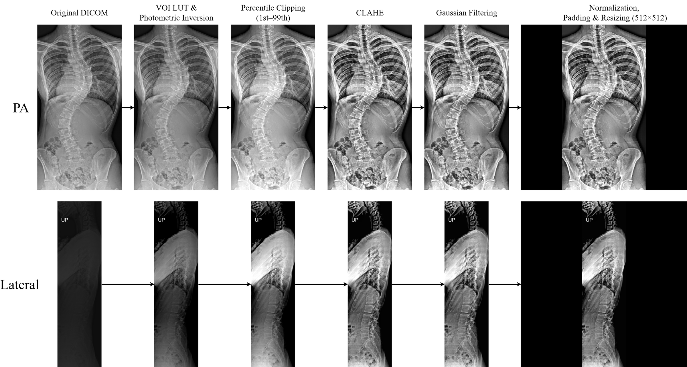

# Preprocessing

Standing PA and lateral radiographs pass through an **identical** pipeline; the two
views are never treated differently before the encoders. The stages are implemented
in [`src/multimodal/dataset.py`](../src/multimodal/dataset.py), and
[`src/common/preprocessing_demo.py`](../src/common/preprocessing_demo.py) renders
each intermediate stage to disk.

## Stages

| # | Stage | Detail |
|---|---|---|
| 1 | Rescale | DICOM `RescaleSlope` / `RescaleIntercept` applied when present |
| 2 | Windowing | `apply_voi_lut` from the header; `MONOCHROME1` images inverted (`max − pixel`) |
| 3 | Intensity clipping | clipped to the 1st–99th percentile |
| 4 | CLAHE | `cv2.createCLAHE`, clip limit 2.0, 8×8 tiles |
| 5 | Gaussian blur | 3×3 kernel, σ = 0.5 |
| 6 | Normalize & pad | min–max to [0, 1], then zero-padded to a square (shorter axis centred) |
| 7 | Resize & cast | 512 × 512 via `cv2.INTER_AREA`, stored as `uint8` |

Stages 1–7 are deterministic and run **offline once**, cached to
`cache/scoliosis_lumbar_<dataset>_<size>.pkl` keyed by `patient_id`. Delete the
cache to force regeneration after changing any preprocessing parameter — the code
does not detect stale caches.

At load time the cached image is replicated to three channels and ImageNet-normalized
(mean `[0.485, 0.456, 0.406]`, std `[0.229, 0.224, 0.225]`).

## Augmentation

Applied on the fly during training only:

| Transform | Parameters |
|---|---|
| Random gamma | γ ~ U(0.98, 1.02) |
| Random contrast | c ~ U(0.95, 1.05), mean-centred |
| Additive Gaussian noise | σ ~ U(0.00, 0.01) |

**Geometric augmentation is deliberately omitted.** No horizontal flipping, no
rotation. Curve direction and left–right orientation are not nuisance variation in
this task — a lumbar curve's laterality and its relationship to the thoracic curve
are part of what distinguishes a structural from a non-structural curve. Flipping a
radiograph would produce an anatomically valid image with an altered relationship to
the label. The augmentation is therefore photometric only, and intentionally mild:
the ranges above perturb intensity by a few percent, enough to discourage
memorization of exposure characteristics without disturbing morphology.

The whole trunk is retained. The field of view is not cropped to the lumbar spine,
because the model's discriminative signal — as the Grad-CAM analysis shows — extends
from the thoracic apex through the thoracolumbar junction.

## Inference transform

Grayscale → 3-channel replication → ImageNet normalization. No augmentation.
